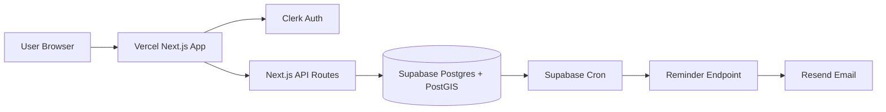

# EventDrop Product and Architecture

## Problem

There is no dominant product for spontaneous, hyperlocal, ephemeral social discovery. EventDrop focuses on events happening within the next 24 hours in one neighborhood or campus.

## Target User

Urban renters and college students aged 22 to 35 who want low-commitment same-day social options nearby.

## Core Flows

1. Browse events without login.
2. Create a drop after signing in.
3. RSVP after signing in.
4. Receive a reminder 30 minutes before event start.
5. Report inappropriate events.

## Architecture

## Technical Decisions

- Vercel: fast deployment, serverless API routes, live URL.
- Serverless compute: fits bursty MVP traffic and avoids server operations.
- Supabase Postgres/PostGIS: supports durable storage and distance queries.
- Clerk: verified user identity for write actions while browse remains public.
- Supabase Cron: supports frequent reminder checks beyond Vercel Hobby Cron limits.
- Resend: simple transactional email API.

## Data Storage and Access

Events, RSVPs, reminders, reports, profiles, and launch-zone config live in Supabase Postgres. Event locations are stored as PostGIS geography points and queried by radius. The Next.js backend uses a server-side Supabase service role key; clients never receive database credentials.
